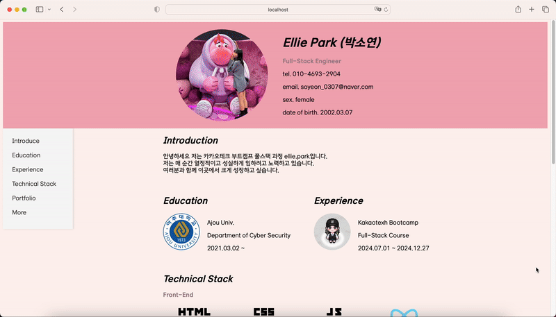
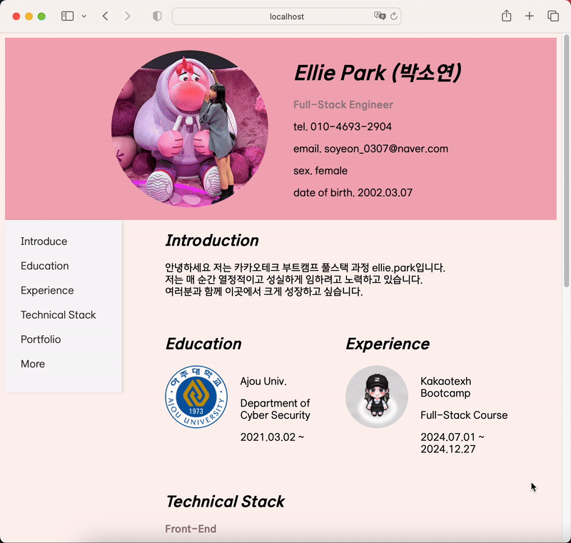

# Resume

HTML로 구현한 Ellie.park의 간단한 이력서 웹 페이지입니다.

## 목차

1. [예시 (Screenshot)](#예시-screenshot)
2. [기능 (Features)](#기능-features)
3. [설치 (Installation)](#설치-installation)
4. [실행 (Usage)](#실행-usage)

## 예시 (Screenshot)

### 디바이스 별 레이아웃
#### PC


#### 태블릿


#### 모바일
 

### 기능 시연


## 기능 (Feature)
1. 디바이스 크기에 따른 레이아웃 변화
  - 태블릿 (해상도 768px ~ 1199px)
    -skill 아이콘의 크기 및 간격 감소
  - 모바일 (해상도 360px ~ 767px)
    -   header 영역 요소들의 배치가 가로에서 세로로 변경
    -   프로필 이미지 크기 감소
    -   header 영역의 글자 가운데 맞춤
    -   네비게이션 바 제거
    -   education과 experience의 배치를 가로에서 세로로 변경
    -   Skill 영역 wrap 속성으로 줄 바꿈 형성
    -   more 영역의 이미지 크기 감소

2. 좌측의 네이게이션 바를 이용하여 원하는 위치로 바로 이동 가능
3. portfolio의 버튼 및 more의 아이콘 클릭 시 연결 링크가 새탭으로 생성


## 설치 (Installation)

```bash
git clone https://github.com/PARK-SSOYEON/resume.git
cd resume
```

## 실행 (Usage)
```bash
python3 -m http.server
http://localhost:8000/ //해당 링크 접속
```
